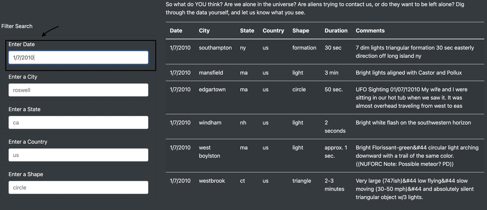
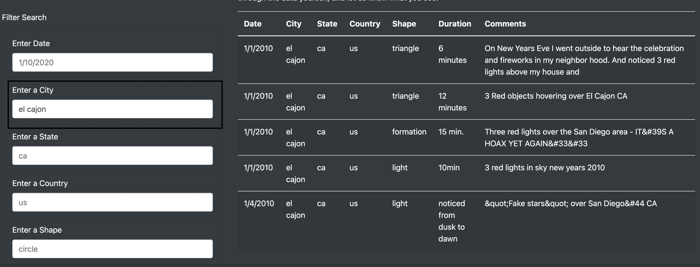
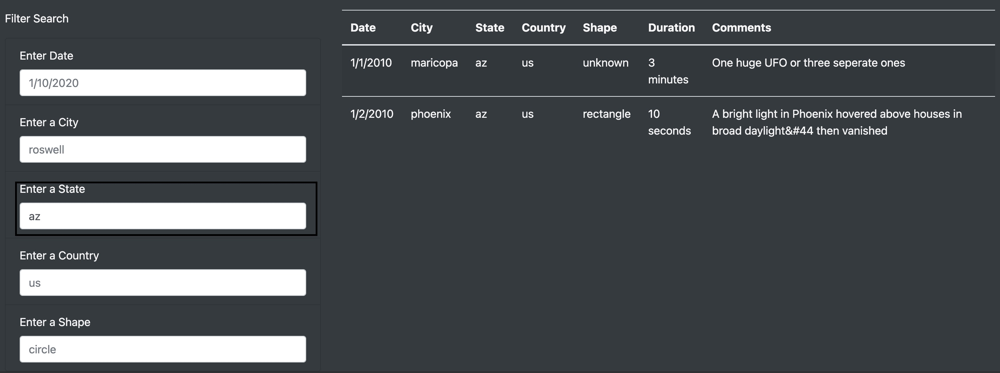
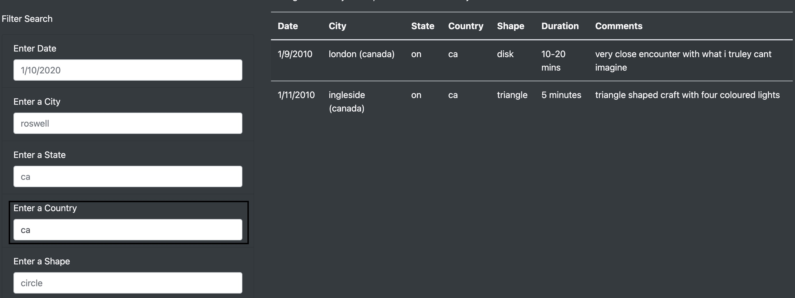
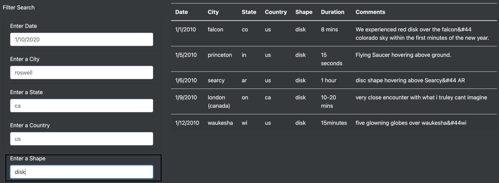

# UFOs

## Summary

The main purpose of this project is to create a dynamic web page that contains a table built using JavaScript, allowing the user to filter by multiple criteria at the same time to provide a more in-depth analysis of UFO sightings. 

## Results 

The new webpage layout is user friendly and easy to understand. 
On the top left-hand side, we have the "UFO Sightings" element that refreshes the page after a search has been carried out. 

On the bottom left side, next to the table data, there is the "Filter Search" element that allows the user to input data and customize their search. There are five filters available and they can be used individually or all at the same time. 

### * Search by date 

The user can narrow down the search by entering a date into the "Enter Date" box. The format is shown by a placeholder example (1/3/2010). After pressing enter, the filter function is activated and only information that meets the search criteria (date) is displayed. 
In this case, we have filtered by the date 1/7/2010 and obtained 6 results. 

## * Search by city

It is possible to filter the data by city. For example, after the user input "el cajon", there were 5 results that matched the filter criteria. 

## * Search by state

A search by state can also be done. For example, we have filtered by the state of Arizona and obtained two results. 

## * Search by country

We can also filter by country. However, there is only data available for the US and Canada. To search for the sightings in Canada, we input ca in the Country box, hit enter and the table should display the data. In this case, there are only two elements for the "ca" search. 

## * Search by Shape
Our final filter is the search by shape. This filter returns all the sightings that match the specified shape. In this case, we obtained five results for the shape "disk" shape. 

##  Summary 

### Drawbacks:

 The new website was created to enable more specific searches. However, certain drawbacks could be addressed for further improvement. 

 When using the filters, the user has to refresh the page every time a filter has been applied which can be inefficient.

#### Recommendations 

 * The filter boxes are case sensitive, which can be confusing. For example, when entering a city or state, we must type everything in lower case, otherwise, nothing is returned. 
  
 * Additionally, the filter data must be entered manually, for example, the country data is only available for the US and Canada which might be hard to tell by just a glance at the table data. A better option would be to have a drop-down list. 

